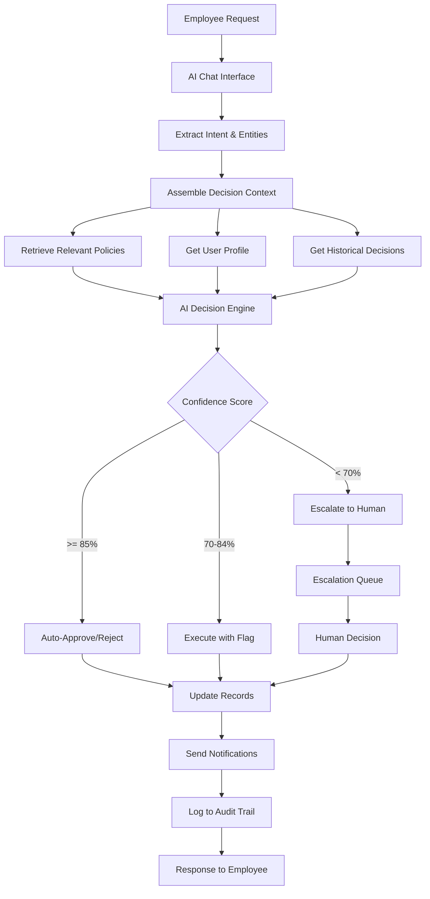

# Software Requirements Specification (SRS)
# Autonomous AI HR Decision Agent

**Version:** 1.0  
**Date:** January 2025  
**Project:** AI-Powered HRMS  
**Team:** INVICTUS  
**Team Leader:** Lovepreet Singh  
**Hackathon:** AWS AI for Bharat Hackathon 2025  
**Repository:** https://github.com/03-lovepreetSingh/HRMS

---

## Document Control

| Version | Date | Author | Changes |
|---------|------|--------|---------|
| 1.0 | January 2025 | INVICTUS Team | Initial SRS Document |

---

## Table of Contents

1. Executive Summary
2. Glossary
3. Business Requirements
4. Functional Requirements
5. Non-Functional Requirements
6. System Constraints
7. Assumptions and Dependencies
8. Data Requirements
9. Interface Requirements
10. Implementation Phases
11. Acceptance Criteria
12. Risks and Mitigation
13. Appendices

---

## 1. Executive Summary

### 1.1 Project Overview

The Autonomous AI HR Decision Agent is an intelligent, AI-powered Human Resource Management System designed specifically for Indian SMEs with 50-500 employees. The system leverages advanced Large Language Models (Claude Sonnet 4.5, GPT-4) to automate routine HR decision-making, reduce manual workload by 60-70%, and provide instant, accurate responses to employee queries.

### 1.2 Problem Statement

Indian SME HR teams currently spend 60-70% of their time handling repetitive queries about leave policies, attendance rules, salary structures, and company policies. This creates:
- Delayed response times for employees
- Inconsistent policy interpretation
- High operational costs
- Poor employee experience
- Limited time for strategic HR initiatives

### 1.3 Solution Overview

The Autonomous AI HR Decision Agent provides:
- **Intelligent Chat Interface**: Natural language interaction for all HR queries
- **Autonomous Decision-Making**: AI-powered approval/rejection of routine requests
- **Policy-Aware Processing**: Context-aware decisions based on company policies
- **Smart Escalation**: Automatic routing of complex cases to human HR
- **Complete Audit Trail**: Full transparency and compliance tracking
- **Multi-Role Support**: Tailored experiences for Admin, HR Manager, Manager, and Employee roles

### 1.4 Target Audience

- **Primary Users**: Indian SMEs (50-500 employees)
- **Geographic Focus**: India
- **Industry Sectors**: Technology, Services, Manufacturing, Retail
- **User Roles**: 
  - Employees (80% of users)
  - Managers (15% of users)
  - HR Managers (4% of users)
  - System Administrators (1% of users)

### 1.5 Success Metrics

- Reduce HR query response time from 24-48 hours to < 5 minutes
- Automate 70% of routine HR decisions
- Achieve 95% accuracy in AI decision-making
- Reduce HR operational costs by 40%
- Achieve 90% employee satisfaction score

---

## 2. Glossary

- **HRMS**: Human Resource Management System
- **LLM**: Large Language Model
- **RAG**: Retrieval-Augmented Generation
- **RBAC**: Role-Based Access Control
- **JWT**: JSON Web Token
- **SME**: Small and Medium Enterprise
- **SLA**: Service Level Agreement
- **AI_Agent**: The autonomous AI system that processes HR requests
- **Escalation**: Process of routing complex decisions to human HR staff
- **Policy_Document**: Structured company policy stored in the system
- **Decision_Context**: Historical and policy information used for AI decisions
- **Audit_Trail**: Complete record of all system actions and decisions
- **Vector_Store**: pgvector database for semantic policy search
- **Embedding**: Vector representation of text for semantic search
- **Confidence_Score**: AI's certainty level in its decision (0-100%)
- **Turborepo**: Monorepo build system for managing multiple packages
- **Drizzle_ORM**: TypeScript ORM for database operations

---

## 3. Business Requirements

### 3.1 Business Objectives

**BO-001: Operational Efficiency**
- **Priority**: Critical
- **Description**: Reduce HR team workload by automating 70% of routine queries and decisions
- **Success Criteria**: 
  - 70% of employee queries resolved without human intervention
  - HR team time spent on repetitive tasks reduced from 60-70% to < 20%
  - Average query resolution time < 5 minutes

**BO-002: Cost Reduction**
- **Priority**: High
- **Description**: Reduce HR operational costs through automation
- **Success Criteria**:
  - 40% reduction in HR operational costs within 6 months
  - ROI positive within 12 months of deployment
  - Reduced need for additional HR staff as company scales

**BO-003: Employee Experience**
- **Priority**: Critical
- **Description**: Provide instant, accurate, and consistent HR support to all employees
- **Success Criteria**:
  - 90% employee satisfaction score
  - < 5 minute average response time
  - 95% first-contact resolution rate

**BO-004: Compliance & Audit**
- **Priority**: Critical
- **Description**: Maintain complete audit trail and ensure regulatory compliance
- **Success Criteria**:
  - 100% of decisions logged with full context
  - Audit reports generated in < 30 seconds
  - Zero compliance violations

**BO-005: Scalability**
- **Priority**: High
- **Description**: Support company growth without proportional HR team expansion
- **Success Criteria**:
  - System handles 10x user growth without performance degradation
  - Onboarding new employees in < 5 minutes
  - Support for multi-location operations

### 3.2 Stakeholders

**Primary Stakeholders:**
- **Employees**: End users seeking HR assistance
- **HR Managers**: Oversee HR operations and handle escalations
- **Managers**: Approve team requests and access team analytics
- **System Administrators**: Configure and maintain the system

**Secondary Stakeholders:**
- **Company Leadership**: Monitor HR metrics and ROI
- **Compliance Officers**: Ensure regulatory adherence
- **IT Team**: Maintain infrastructure and integrations

**External Stakeholders:**
- **AWS**: Cloud infrastructure provider
- **Anthropic/OpenAI**: LLM service providers
- **Regulatory Bodies**: Labor law compliance authorities

---

## 4. Functional Requirements

### 4.1 User Management (UM)

#### Requirement UM-001: User Authentication

**Priority**: Critical  
**User Story**: As a user, I want to securely log in to the system, so that I can access HR services appropriate to my role.

**Acceptance Criteria**:

1. WHEN a user provides valid credentials, THE Authentication_System SHALL generate a JWT token with role information
2. WHEN a user provides invalid credentials, THE Authentication_System SHALL reject the login and log the attempt
3. WHEN a JWT token expires, THE Authentication_System SHALL require re-authentication
4. THE Authentication_System SHALL enforce password complexity requirements (minimum 8 characters, uppercase, lowercase, number, special character)
5. WHEN a user fails authentication 5 times, THE Authentication_System SHALL lock the account for 30 minutes

**Dependencies**: None

---

#### Requirement UM-002: Role-Based Access Control

**Priority**: Critical  
**User Story**: As a system administrator, I want to enforce role-based permissions, so that users can only access features appropriate to their role.

**Acceptance Criteria**:

1. THE RBAC_System SHALL support four roles: Admin, HR_Manager, Manager, Employee
2. WHEN a user attempts to access a resource, THE RBAC_System SHALL verify the user has the required permission
3. WHEN a user lacks required permissions, THE RBAC_System SHALL deny access and return a 403 error
4. THE RBAC_System SHALL allow Admins to assign and modify user roles
5. WHEN a user's role changes, THE RBAC_System SHALL update permissions immediately

**Dependencies**: UM-001

---

#### Requirement UM-003: User Profile Management

**Priority**: High  
**User Story**: As an employee, I want to view and update my profile information, so that my HR records are accurate.

**Acceptance Criteria**:

1. THE Profile_System SHALL display user information including name, email, department, designation, manager, and join date
2. WHEN an employee updates editable fields, THE Profile_System SHALL validate and save the changes
3. THE Profile_System SHALL restrict editing of sensitive fields (employee ID, salary, role) to HR_Manager and Admin roles
4. WHEN profile changes are saved, THE Profile_System SHALL log the change in the audit trail
5. THE Profile_System SHALL display profile completion percentage

**Dependencies**: UM-001, UM-002

---

### 4.2 AI Chat Interface (AI)

#### Requirement AI-001: Natural Language Query Processing

**Priority**: Critical  
**User Story**: As an employee, I want to ask HR questions in natural language, so that I can get instant answers without navigating complex menus.

**Acceptance Criteria**:

1. WHEN a user submits a text query, THE AI_Chat_Interface SHALL process it using the LLM
2. THE AI_Chat_Interface SHALL support queries in English and Hindi
3. WHEN processing a query, THE AI_Chat_Interface SHALL retrieve relevant policy context using RAG
4. THE AI_Chat_Interface SHALL respond within 5 seconds for 95% of queries
5. WHEN the AI cannot understand a query, THE AI_Chat_Interface SHALL ask clarifying questions

**Dependencies**: PM-001, DE-001

---

#### Requirement AI-002: Conversational Context Management

**Priority**: High  
**User Story**: As an employee, I want the AI to remember our conversation context, so that I don't have to repeat information.

**Acceptance Criteria**:

1. THE AI_Chat_Interface SHALL maintain conversation history for the current session
2. WHEN processing a query, THE AI_Chat_Interface SHALL consider the previous 10 messages as context
3. THE AI_Chat_Interface SHALL support follow-up questions without requiring full context repetition
4. WHEN a user starts a new topic, THE AI_Chat_Interface SHALL detect the context switch
5. THE AI_Chat_Interface SHALL persist conversation history for 30 days

**Dependencies**: AI-001

---

#### Requirement AI-003: Multi-Modal Response Generation

**Priority**: Medium  
**User Story**: As an employee, I want to receive responses in various formats, so that I can understand information easily.

**Acceptance Criteria**:

1. THE AI_Chat_Interface SHALL generate text responses for all queries
2. WHERE policy documents are referenced, THE AI_Chat_Interface SHALL provide clickable links
3. WHEN numerical data is relevant, THE AI_Chat_Interface SHALL format it in tables
4. THE AI_Chat_Interface SHALL support markdown formatting in responses
5. WHEN appropriate, THE AI_Chat_Interface SHALL suggest related questions

**Dependencies**: AI-001, PM-001

---

#### Requirement AI-004: Real-Time Typing Indicators

**Priority**: Low  
**User Story**: As an employee, I want to see when the AI is processing my query, so that I know the system is working.

**Acceptance Criteria**:

1. WHEN the AI is processing a query, THE AI_Chat_Interface SHALL display a typing indicator
2. THE AI_Chat_Interface SHALL use WebSocket for real-time updates
3. WHEN the response is ready, THE AI_Chat_Interface SHALL remove the typing indicator
4. THE AI_Chat_Interface SHALL show estimated processing time for queries taking > 3 seconds
5. WHEN processing fails, THE AI_Chat_Interface SHALL display an error message

**Dependencies**: AI-001

---

### 4.3 Leave Management (LM)

#### Requirement LM-001: Leave Request Submission

**Priority**: Critical  
**User Story**: As an employee, I want to submit leave requests through the AI chat, so that I can request time off conversationally.

**Acceptance Criteria**:

1. WHEN an employee requests leave via chat, THE Leave_System SHALL extract leave type, start date, end date, and reason
2. THE Leave_System SHALL validate that the employee has sufficient leave balance
3. WHEN leave dates overlap with existing approved leaves, THE Leave_System SHALL reject the request
4. THE Leave_System SHALL calculate the number of leave days excluding weekends and holidays
5. WHEN a leave request is submitted, THE Leave_System SHALL create a pending request record

**Dependencies**: AI-001, EMP-001

---

#### Requirement LM-002: Autonomous Leave Approval

**Priority**: Critical  
**User Story**: As an employee, I want routine leave requests to be approved instantly by AI, so that I don't have to wait for manual approval.

**Acceptance Criteria**:

1. WHEN a leave request meets auto-approval criteria, THE AI_Decision_Engine SHALL approve it automatically
2. THE AI_Decision_Engine SHALL auto-approve requests where: leave balance is sufficient, no team conflicts exist, duration ≤ 3 days, and advance notice ≥ 2 days
3. WHEN auto-approved, THE Leave_System SHALL notify the employee and manager immediately
4. THE Leave_System SHALL update leave balance immediately upon approval
5. THE AI_Decision_Engine SHALL log the decision rationale with confidence score

**Dependencies**: LM-001, DE-001, PM-002

---

#### Requirement LM-003: Leave Request Escalation

**Priority**: High  
**User Story**: As an HR manager, I want complex leave requests escalated to me, so that I can make informed decisions on edge cases.

**Acceptance Criteria**:

1. WHEN a leave request doesn't meet auto-approval criteria, THE Escalation_System SHALL route it to the appropriate approver
2. THE Escalation_System SHALL escalate to manager for: duration > 3 days, advance notice < 2 days, or team capacity concerns
3. THE Escalation_System SHALL escalate to HR for: negative leave balance, policy exceptions, or extended leaves (> 10 days)
4. WHEN escalated, THE Escalation_System SHALL provide AI recommendation with confidence score
5. THE Escalation_System SHALL notify the approver within 1 minute of escalation

**Dependencies**: LM-001, EM-001

---

#### Requirement LM-004: Leave Balance Tracking

**Priority**: High  
**User Story**: As an employee, I want to check my leave balance through chat, so that I know how much leave I have available.

**Acceptance Criteria**:

1. WHEN an employee queries leave balance, THE Leave_System SHALL display current balance for all leave types
2. THE Leave_System SHALL show: total allocated, used, pending approval, and available leaves
3. THE Leave_System SHALL calculate leave accrual based on company policy
4. WHEN displaying balance, THE Leave_System SHALL include upcoming approved leaves
5. THE Leave_System SHALL support queries like "How many leaves do I have?" in natural language

**Dependencies**: AI-001, LM-001

---

#### Requirement LM-005: Leave History and Reports

**Priority**: Medium  
**User Story**: As a manager, I want to view my team's leave history, so that I can plan team capacity.

**Acceptance Criteria**:

1. THE Leave_System SHALL display leave history with filters for date range, leave type, and status
2. WHEN a manager requests team leave report, THE Leave_System SHALL show all team members' leave data
3. THE Leave_System SHALL generate leave reports in CSV and PDF formats
4. THE Leave_System SHALL display leave calendar view showing team availability
5. THE Leave_System SHALL highlight potential team capacity issues

**Dependencies**: LM-001, UM-002

---

### 4.4 Policy Management (PM)

#### Requirement PM-001: Policy Document Storage

**Priority**: Critical  
**User Story**: As an HR manager, I want to upload and manage company policies, so that the AI can reference them for decisions.

**Acceptance Criteria**:

1. THE Policy_System SHALL support uploading policies in PDF, DOCX, and TXT formats
2. WHEN a policy is uploaded, THE Policy_System SHALL extract text and create vector embeddings
3. THE Policy_System SHALL store embeddings in pgvector for semantic search
4. THE Policy_System SHALL support policy versioning with effective dates
5. WHEN a policy is updated, THE Policy_System SHALL archive the previous version

**Dependencies**: None

---

#### Requirement PM-002: Semantic Policy Search

**Priority**: Critical  
**User Story**: As the AI system, I want to retrieve relevant policy sections, so that I can make informed decisions.

**Acceptance Criteria**:

1. WHEN processing a query, THE Policy_System SHALL perform semantic search using vector similarity
2. THE Policy_System SHALL return the top 5 most relevant policy sections
3. THE Policy_System SHALL include similarity scores with each result
4. THE Policy_System SHALL filter results by policy effective date
5. WHEN no relevant policy is found, THE Policy_System SHALL return an empty result set

**Dependencies**: PM-001

---

#### Requirement PM-003: Policy Categories and Tags

**Priority**: Medium  
**User Story**: As an HR manager, I want to categorize policies, so that they are easier to manage and search.

**Acceptance Criteria**:

1. THE Policy_System SHALL support policy categories: Leave, Attendance, Compensation, Benefits, Code of Conduct, IT, Travel
2. WHEN creating a policy, THE Policy_System SHALL require category selection
3. THE Policy_System SHALL support custom tags for policies
4. THE Policy_System SHALL allow filtering policies by category and tags
5. THE Policy_System SHALL display policy metadata including category, tags, version, and effective date

**Dependencies**: PM-001

---

#### Requirement PM-004: Policy Approval Workflow

**Priority**: Medium  
**User Story**: As an admin, I want to review policies before they become active, so that I can ensure accuracy.

**Acceptance Criteria**:

1. WHEN a policy is uploaded, THE Policy_System SHALL set status to "Draft"
2. THE Policy_System SHALL require admin approval before status changes to "Active"
3. WHEN a policy is approved, THE Policy_System SHALL set the effective date
4. THE Policy_System SHALL support policy rejection with comments
5. THE Policy_System SHALL notify relevant stakeholders of policy status changes

**Dependencies**: PM-001, UM-002

---

### 4.5 AI Decision Engine (DE)

#### Requirement DE-001: Decision Context Assembly

**Priority**: Critical  
**User Story**: As the AI system, I want to gather all relevant context, so that I can make informed decisions.

**Acceptance Criteria**:

1. WHEN processing a request, THE Decision_Engine SHALL retrieve user profile data
2. THE Decision_Engine SHALL retrieve relevant policy sections using semantic search
3. THE Decision_Engine SHALL retrieve historical decisions for similar cases
4. THE Decision_Engine SHALL retrieve team context (manager, department, team capacity)
5. THE Decision_Engine SHALL assemble all context within 2 seconds

**Dependencies**: PM-002, EMP-001, AC-001

---

#### Requirement DE-002: LLM-Based Decision Making

**Priority**: Critical  
**User Story**: As the AI system, I want to analyze requests using LLM, so that I can make accurate decisions.

**Acceptance Criteria**:

1. THE Decision_Engine SHALL use Claude Sonnet 4.5 as the primary LLM
2. WHEN Claude is unavailable, THE Decision_Engine SHALL fallback to GPT-4
3. THE Decision_Engine SHALL provide structured prompts including context, policies, and decision criteria
4. THE Decision_Engine SHALL request structured JSON responses from the LLM
5. THE Decision_Engine SHALL include decision rationale and confidence score in the response

**Dependencies**: DE-001, PM-002

---

#### Requirement DE-003: Confidence-Based Routing

**Priority**: Critical  
**User Story**: As the system, I want to escalate low-confidence decisions, so that humans review uncertain cases.

**Acceptance Criteria**:

1. WHEN the AI confidence score is ≥ 85%, THE Decision_Engine SHALL execute the decision autonomously
2. WHEN the AI confidence score is 70-84%, THE Decision_Engine SHALL execute but flag for post-decision review
3. WHEN the AI confidence score is < 70%, THE Decision_Engine SHALL escalate to human approver
4. THE Decision_Engine SHALL log confidence scores for all decisions
5. THE Decision_Engine SHALL allow admins to configure confidence thresholds

**Dependencies**: DE-002, EM-001

---

#### Requirement DE-004: Decision Validation Rules

**Priority**: High  
**User Story**: As a system administrator, I want to define validation rules, so that AI decisions comply with hard constraints.

**Acceptance Criteria**:

1. THE Decision_Engine SHALL validate decisions against configured business rules
2. THE Decision_Engine SHALL enforce rules for: leave balance, advance notice, team capacity, and policy compliance
3. WHEN a decision violates a rule, THE Decision_Engine SHALL reject it regardless of AI recommendation
4. THE Decision_Engine SHALL log rule violations with details
5. THE Decision_Engine SHALL allow admins to configure and update validation rules

**Dependencies**: DE-002

---

#### Requirement DE-005: Learning from Feedback

**Priority**: Medium  
**User Story**: As the system, I want to learn from human corrections, so that I improve decision accuracy over time.

**Acceptance Criteria**:

1. WHEN a human overrides an AI decision, THE Decision_Engine SHALL log the override with rationale
2. THE Decision_Engine SHALL store override cases as training examples
3. THE Decision_Engine SHALL include override cases in context for similar future requests
4. THE Decision_Engine SHALL generate monthly reports on override patterns
5. THE Decision_Engine SHALL suggest policy updates based on frequent overrides

**Dependencies**: DE-002, AC-001, EM-002

---

### 4.6 Escalation Management (EM)

#### Requirement EM-001: Automatic Escalation Routing

**Priority**: Critical  
**User Story**: As an employee, I want complex requests automatically routed to the right person, so that I get timely decisions.

**Acceptance Criteria**:

1. WHEN a request requires escalation, THE Escalation_System SHALL determine the appropriate approver
2. THE Escalation_System SHALL route to manager for: team-level decisions, leave > 3 days, attendance issues
3. THE Escalation_System SHALL route to HR for: policy exceptions, extended leaves, compensation queries, disciplinary matters
4. THE Escalation_System SHALL route to admin for: system configuration, policy changes, role assignments
5. THE Escalation_System SHALL notify the approver within 1 minute via email and in-app notification

**Dependencies**: UM-002, NOT-001

---

#### Requirement EM-002: Escalation Queue Management

**Priority**: High  
**User Story**: As an HR manager, I want to view and manage my escalation queue, so that I can prioritize urgent requests.

**Acceptance Criteria**:

1. THE Escalation_System SHALL display pending escalations sorted by priority and age
2. THE Escalation_System SHALL show: request details, AI recommendation, confidence score, and context
3. THE Escalation_System SHALL allow approvers to approve, reject, or request more information
4. WHEN an approver takes action, THE Escalation_System SHALL notify the requester immediately
5. THE Escalation_System SHALL highlight escalations pending > 24 hours

**Dependencies**: EM-001, NOT-001

---

#### Requirement EM-003: Escalation SLA Tracking

**Priority**: High  
**User Story**: As an admin, I want to track escalation response times, so that I can ensure timely decisions.

**Acceptance Criteria**:

1. THE Escalation_System SHALL track time from escalation to resolution
2. THE Escalation_System SHALL define SLAs: Manager (4 hours), HR (8 hours), Admin (24 hours)
3. WHEN an escalation approaches SLA breach, THE Escalation_System SHALL send reminder notifications
4. WHEN an SLA is breached, THE Escalation_System SHALL escalate to the next level
5. THE Escalation_System SHALL generate SLA compliance reports

**Dependencies**: EM-001, EM-002

---

#### Requirement EM-004: Escalation Comments and Collaboration

**Priority**: Medium  
**User Story**: As an approver, I want to add comments and collaborate on escalations, so that I can gather input before deciding.

**Acceptance Criteria**:

1. THE Escalation_System SHALL allow approvers to add comments to escalations
2. THE Escalation_System SHALL support @mentions to involve other users
3. WHEN mentioned, THE Escalation_System SHALL notify the user immediately
4. THE Escalation_System SHALL display comment history chronologically
5. THE Escalation_System SHALL allow approvers to reassign escalations to others

**Dependencies**: EM-002, NOT-001

---

### 4.7 Audit & Compliance (AC)

#### Requirement AC-001: Comprehensive Audit Logging

**Priority**: Critical  
**User Story**: As a compliance officer, I want complete audit trails, so that I can verify all system actions.

**Acceptance Criteria**:

1. THE Audit_System SHALL log all user actions including: login, logout, data access, data modification, and decision actions
2. THE Audit_System SHALL log all AI decisions including: request, context, decision, rationale, and confidence score
3. THE Audit_System SHALL log all policy changes including: old version, new version, changed by, and timestamp
4. THE Audit_System SHALL store logs immutably (append-only)
5. THE Audit_System SHALL retain logs for minimum 7 years

**Dependencies**: None

---

#### Requirement AC-002: Audit Trail Search and Filtering

**Priority**: High  
**User Story**: As an admin, I want to search audit logs, so that I can investigate specific incidents.

**Acceptance Criteria**:

1. THE Audit_System SHALL support filtering by: user, action type, date range, entity type, and decision outcome
2. THE Audit_System SHALL support full-text search across log entries
3. THE Audit_System SHALL return search results within 3 seconds for queries on 1 million records
4. THE Audit_System SHALL display results with pagination (50 records per page)
5. THE Audit_System SHALL allow exporting search results to CSV

**Dependencies**: AC-001

---

#### Requirement AC-003: Compliance Reporting

**Priority**: High  
**User Story**: As a compliance officer, I want to generate compliance reports, so that I can demonstrate regulatory adherence.

**Acceptance Criteria**:

1. THE Audit_System SHALL generate reports for: all decisions, escalations, policy changes, and access logs
2. THE Audit_System SHALL support date range selection for reports
3. THE Audit_System SHALL generate reports in PDF and CSV formats
4. THE Audit_System SHALL include summary statistics in reports
5. THE Audit_System SHALL generate reports within 30 seconds

**Dependencies**: AC-001

---

#### Requirement AC-004: Decision Explainability

**Priority**: Critical  
**User Story**: As an employee, I want to understand why a decision was made, so that I can trust the system.

**Acceptance Criteria**:

1. WHEN displaying a decision, THE Audit_System SHALL show the decision rationale
2. THE Audit_System SHALL display which policies were referenced
3. THE Audit_System SHALL show the confidence score
4. THE Audit_System SHALL display historical similar cases if available
5. THE Audit_System SHALL allow users to request human review of any decision

**Dependencies**: AC-001, DE-002

---

#### Requirement AC-005: Data Privacy and Anonymization

**Priority**: Critical  
**User Story**: As a data protection officer, I want to ensure user privacy, so that we comply with data protection regulations.

**Acceptance Criteria**:

1. THE Audit_System SHALL anonymize personal data in logs older than 90 days
2. THE Audit_System SHALL support user data deletion requests (right to be forgotten)
3. WHEN a user is deleted, THE Audit_System SHALL anonymize their data while preserving audit integrity
4. THE Audit_System SHALL encrypt sensitive data at rest
5. THE Audit_System SHALL restrict access to audit logs based on RBAC

**Dependencies**: AC-001, UM-002

---

### 4.8 Employee Management (EMP)

#### Requirement EMP-001: Employee Profile Repository

**Priority**: Critical  
**User Story**: As the system, I want to maintain employee profiles, so that I can provide personalized services.

**Acceptance Criteria**:

1. THE Employee_System SHALL store: employee ID, name, email, phone, department, designation, manager, join date, and employment type
2. THE Employee_System SHALL store leave balances for all leave types
3. THE Employee_System SHALL store reporting hierarchy (manager chain)
4. THE Employee_System SHALL support custom fields configured by admin
5. THE Employee_System SHALL validate data integrity on all updates

**Dependencies**: None

---

#### Requirement EMP-002: Organizational Hierarchy

**Priority**: High  
**User Story**: As a manager, I want to view my team structure, so that I can understand reporting relationships.

**Acceptance Criteria**:

1. THE Employee_System SHALL maintain manager-employee relationships
2. THE Employee_System SHALL display organizational chart for any employee
3. THE Employee_System SHALL support querying all direct reports for a manager
4. THE Employee_System SHALL support querying all indirect reports (entire hierarchy)
5. THE Employee_System SHALL detect and prevent circular reporting relationships

**Dependencies**: EMP-001

---

#### Requirement EMP-003: Employee Onboarding

**Priority**: High  
**User Story**: As an HR manager, I want to onboard new employees quickly, so that they can start using the system immediately.

**Acceptance Criteria**:

1. THE Employee_System SHALL support bulk employee import via CSV
2. WHEN a new employee is added, THE Employee_System SHALL create user account, assign role, and allocate leave balance
3. THE Employee_System SHALL send welcome email with login credentials
4. THE Employee_System SHALL assign the employee to their manager
5. THE Employee_System SHALL complete onboarding within 5 minutes

**Dependencies**: EMP-001, UM-001, NOT-001

---

#### Requirement EMP-004: Employee Search and Directory

**Priority**: Medium  
**User Story**: As an employee, I want to search for colleagues, so that I can find contact information.

**Acceptance Criteria**:

1. THE Employee_System SHALL support search by name, email, department, and designation
2. THE Employee_System SHALL display search results with basic profile information
3. THE Employee_System SHALL support filtering by department and location
4. THE Employee_System SHALL return search results within 1 second
5. THE Employee_System SHALL respect privacy settings (hide sensitive information)

**Dependencies**: EMP-001, UM-002

---

### 4.9 Attendance Management (ATT)

#### Requirement ATT-001: Attendance Tracking

**Priority**: High  
**User Story**: As an employee, I want to mark my attendance, so that my work hours are recorded.

**Acceptance Criteria**:

1. THE Attendance_System SHALL support check-in and check-out actions
2. WHEN an employee checks in, THE Attendance_System SHALL record timestamp and location (if enabled)
3. THE Attendance_System SHALL calculate total work hours for each day
4. THE Attendance_System SHALL detect missing check-ins or check-outs
5. THE Attendance_System SHALL support manual attendance correction by HR

**Dependencies**: EMP-001

---

#### Requirement ATT-002: Attendance Regularization

**Priority**: High  
**User Story**: As an employee, I want to request attendance corrections through chat, so that I can fix missed check-ins.

**Acceptance Criteria**:

1. WHEN an employee requests attendance regularization via chat, THE Attendance_System SHALL extract date, check-in time, check-out time, and reason
2. THE Attendance_System SHALL validate that the date is within the last 7 days
3. THE Attendance_System SHALL route regularization requests to the employee's manager
4. WHEN approved, THE Attendance_System SHALL update attendance records
5. THE Attendance_System SHALL maintain audit trail of all regularizations

**Dependencies**: ATT-001, AI-001, EM-001

---

#### Requirement ATT-003: Attendance Reports

**Priority**: Medium  
**User Story**: As a manager, I want to view team attendance reports, so that I can monitor attendance patterns.

**Acceptance Criteria**:

1. THE Attendance_System SHALL generate attendance reports for selected date ranges
2. THE Attendance_System SHALL display: present days, absent days, late arrivals, early departures, and total work hours
3. THE Attendance_System SHALL highlight attendance policy violations
4. THE Attendance_System SHALL support exporting reports to CSV and PDF
5. THE Attendance_System SHALL generate reports within 10 seconds

**Dependencies**: ATT-001

---

#### Requirement ATT-004: Attendance Policy Enforcement

**Priority**: Medium  
**User Story**: As an HR manager, I want to enforce attendance policies, so that employees maintain required work hours.

**Acceptance Criteria**:

1. THE Attendance_System SHALL validate attendance against configured policies
2. THE Attendance_System SHALL flag violations: late arrivals (> 15 minutes), early departures (> 15 minutes), insufficient work hours (< 8 hours)
3. WHEN violations exceed threshold, THE Attendance_System SHALL notify manager and HR
4. THE Attendance_System SHALL support configurable grace periods
5. THE Attendance_System SHALL generate monthly attendance compliance reports

**Dependencies**: ATT-001, PM-001

---

### 4.10 Task Management (TM)

#### Requirement TM-001: Task Creation and Assignment

**Priority**: Medium  
**User Story**: As a manager, I want to create and assign tasks, so that I can track team deliverables.

**Acceptance Criteria**:

1. THE Task_System SHALL support creating tasks with: title, description, assignee, due date, and priority
2. THE Task_System SHALL allow assigning tasks to team members
3. WHEN a task is assigned, THE Task_System SHALL notify the assignee
4. THE Task_System SHALL support task priorities: Low, Medium, High, Critical
5. THE Task_System SHALL validate that assignee is in the manager's team

**Dependencies**: EMP-001, NOT-001

---

#### Requirement TM-002: Task Status Tracking

**Priority**: Medium  
**User Story**: As an employee, I want to update task status, so that my manager knows my progress.

**Acceptance Criteria**:

1. THE Task_System SHALL support task statuses: To Do, In Progress, Blocked, Completed
2. WHEN an employee updates task status, THE Task_System SHALL record timestamp
3. THE Task_System SHALL allow adding comments to tasks
4. THE Task_System SHALL notify manager when task status changes to Blocked or Completed
5. THE Task_System SHALL track time spent on each status

**Dependencies**: TM-001

---

#### Requirement TM-003: Task Queries via Chat

**Priority**: Low  
**User Story**: As an employee, I want to query my tasks through chat, so that I can quickly check my to-do list.

**Acceptance Criteria**:

1. WHEN an employee asks about tasks via chat, THE Task_System SHALL list pending tasks
2. THE Task_System SHALL support queries like "What are my tasks?", "Show overdue tasks", "Tasks due this week"
3. THE Task_System SHALL display tasks sorted by priority and due date
4. THE Task_System SHALL allow marking tasks complete via chat
5. THE Task_System SHALL provide task summaries in natural language

**Dependencies**: TM-001, AI-001

---

### 4.11 Notifications (NOT)

#### Requirement NOT-001: Multi-Channel Notifications

**Priority**: High  
**User Story**: As a user, I want to receive notifications through multiple channels, so that I don't miss important updates.

**Acceptance Criteria**:

1. THE Notification_System SHALL support in-app, email, and WebSocket notifications
2. THE Notification_System SHALL send notifications for: leave approvals/rejections, escalations, task assignments, policy updates, and system alerts
3. THE Notification_System SHALL allow users to configure notification preferences per channel
4. THE Notification_System SHALL deliver in-app notifications within 1 second
5. THE Notification_System SHALL deliver email notifications within 5 minutes

**Dependencies**: None

---

#### Requirement NOT-002: Notification Templates

**Priority**: Medium  
**User Story**: As an admin, I want to customize notification templates, so that messages align with company tone.

**Acceptance Criteria**:

1. THE Notification_System SHALL support customizable templates for all notification types
2. THE Notification_System SHALL support template variables for dynamic content
3. THE Notification_System SHALL support templates in English and Hindi
4. THE Notification_System SHALL preview templates before saving
5. THE Notification_System SHALL maintain version history of templates

**Dependencies**: NOT-001

---

#### Requirement NOT-003: Notification History

**Priority**: Low  
**User Story**: As a user, I want to view notification history, so that I can review past alerts.

**Acceptance Criteria**:

1. THE Notification_System SHALL store all notifications for 90 days
2. THE Notification_System SHALL display notification history with filters for type and date
3. THE Notification_System SHALL mark notifications as read/unread
4. THE Notification_System SHALL support bulk actions (mark all as read, delete)
5. THE Notification_System SHALL display unread notification count

**Dependencies**: NOT-001

---

### 4.12 Dashboard & Analytics (DA)

#### Requirement DA-001: Employee Dashboard

**Priority**: High  
**User Story**: As an employee, I want to see my dashboard, so that I can quickly access key information.

**Acceptance Criteria**:

1. THE Dashboard_System SHALL display: leave balance, pending requests, upcoming leaves, recent attendance, and pending tasks
2. THE Dashboard_System SHALL display quick action buttons for common tasks
3. THE Dashboard_System SHALL show recent chat conversations
4. THE Dashboard_System SHALL display company announcements
5. THE Dashboard_System SHALL load within 2 seconds

**Dependencies**: LM-001, ATT-001, TM-001

---

#### Requirement DA-002: Manager Dashboard

**Priority**: High  
**User Story**: As a manager, I want to see team analytics, so that I can monitor team performance.

**Acceptance Criteria**:

1. THE Dashboard_System SHALL display: team size, pending approvals, team leave calendar, attendance summary, and task completion rate
2. THE Dashboard_System SHALL show team members on leave today
3. THE Dashboard_System SHALL highlight pending escalations requiring action
4. THE Dashboard_System SHALL display team performance trends
5. THE Dashboard_System SHALL support drilling down into individual employee details

**Dependencies**: LM-001, ATT-001, TM-001, EM-001

---

#### Requirement DA-003: HR Analytics Dashboard

**Priority**: High  
**User Story**: As an HR manager, I want to see organization-wide analytics, so that I can make data-driven decisions.

**Acceptance Criteria**:

1. THE Dashboard_System SHALL display: total employees, leave utilization, attendance compliance, AI automation rate, and escalation volume
2. THE Dashboard_System SHALL show AI decision accuracy and confidence trends
3. THE Dashboard_System SHALL display department-wise metrics
4. THE Dashboard_System SHALL show top escalation reasons
5. THE Dashboard_System SHALL support exporting analytics to PDF

**Dependencies**: LM-001, ATT-001, DE-001, EM-001, AC-001

---

#### Requirement DA-004: Custom Reports

**Priority**: Medium  
**User Story**: As an admin, I want to create custom reports, so that I can analyze specific metrics.

**Acceptance Criteria**:

1. THE Dashboard_System SHALL support creating custom reports with selected metrics
2. THE Dashboard_System SHALL support filtering by: date range, department, employee, and status
3. THE Dashboard_System SHALL support visualizations: bar charts, line charts, pie charts, and tables
4. THE Dashboard_System SHALL allow saving and scheduling reports
5. THE Dashboard_System SHALL support exporting reports to CSV, PDF, and Excel

**Dependencies**: DA-001, DA-002, DA-003

---

#### Requirement DA-005: Real-Time Metrics

**Priority**: Low  
**User Story**: As an admin, I want to see real-time system metrics, so that I can monitor system health.

**Acceptance Criteria**:

1. THE Dashboard_System SHALL display: active users, chat queries per hour, AI response time, and system uptime
2. THE Dashboard_System SHALL show LLM API usage and costs
3. THE Dashboard_System SHALL display error rates and failed requests
4. THE Dashboard_System SHALL update metrics every 30 seconds
5. THE Dashboard_System SHALL alert when metrics exceed thresholds

**Dependencies**: None

---

## 5. Non-Functional Requirements

### 5.1 Performance Requirements

#### Requirement PERF-001: Response Time

**Priority**: Critical  
**ID**: PERF-001  
**Metric**: 95th percentile response time  
**Threshold**: 
- AI chat responses: < 5 seconds
- Page loads: < 2 seconds
- API calls: < 500ms
- Search queries: < 1 second

**Measurement**: Application Performance Monitoring (APM) tools, CloudWatch metrics  
**Criticality**: System unusable if response times exceed thresholds by 50%

---

#### Requirement PERF-002: Throughput

**Priority**: High  
**ID**: PERF-002  
**Metric**: Requests per second  
**Threshold**:
- Support 100 concurrent users per 100 employees
- Handle 1000 chat messages per minute
- Process 500 leave requests per hour
- Support 10,000 API calls per minute

**Measurement**: Load testing with Apache JMeter, AWS CloudWatch  
**Criticality**: Must scale linearly with user growth

---

#### Requirement PERF-003: Database Performance

**Priority**: High  
**ID**: PERF-003  
**Metric**: Query execution time  
**Threshold**:
- Simple queries: < 50ms
- Complex queries with joins: < 200ms
- Vector similarity search: < 500ms
- Report generation: < 30 seconds

**Measurement**: PostgreSQL query logs, pg_stat_statements  
**Criticality**: Database bottlenecks impact all system operations

---

#### Requirement PERF-004: LLM API Latency

**Priority**: Critical  
**ID**: PERF-004  
**Metric**: LLM API response time  
**Threshold**:
- Claude Sonnet 4.5: < 3 seconds (95th percentile)
- GPT-4 fallback: < 4 seconds (95th percentile)
- Embedding generation: < 1 second

**Measurement**: API monitoring, custom metrics  
**Criticality**: Core functionality depends on LLM performance

---

### 5.2 Security Requirements

#### Requirement SEC-001: Authentication Security

**Priority**: Critical  
**ID**: SEC-001  
**Metric**: Authentication security compliance  
**Threshold**:
- JWT tokens expire in 24 hours
- Refresh tokens expire in 7 days
- Password complexity: min 8 chars, uppercase, lowercase, number, special char
- Account lockout after 5 failed attempts for 30 minutes
- Support for 2FA (future enhancement)

**Measurement**: Security audit logs, penetration testing  
**Criticality**: Unauthorized access could expose sensitive employee data

---

#### Requirement SEC-002: Data Encryption

**Priority**: Critical  
**ID**: SEC-002  
**Metric**: Encryption coverage  
**Threshold**:
- All data encrypted at rest using AES-256
- All data encrypted in transit using TLS 1.3
- Database connections encrypted
- Sensitive fields (salary, PII) encrypted at application level

**Measurement**: Security scans, compliance audits  
**Criticality**: Data breach could result in legal liability

---

#### Requirement SEC-003: API Security

**Priority**: Critical  
**ID**: SEC-003  
**Metric**: API security compliance  
**Threshold**:
- All APIs require authentication
- Rate limiting: 100 requests per minute per user
- Input validation on all endpoints
- SQL injection prevention
- XSS prevention

**Measurement**: Security testing, OWASP compliance checks  
**Criticality**: API vulnerabilities could compromise entire system

---

#### Requirement SEC-004: Role-Based Access Control

**Priority**: Critical  
**ID**: SEC-004  
**Metric**: RBAC enforcement  
**Threshold**:
- 100% of endpoints enforce RBAC
- Zero unauthorized access incidents
- Audit log for all permission checks
- Principle of least privilege enforced

**Measurement**: Access control audits, penetration testing  
**Criticality**: Improper access control could expose sensitive data

---

#### Requirement SEC-005: Audit Logging

**Priority**: Critical  
**ID**: SEC-005  
**Metric**: Audit log completeness  
**Threshold**:
- 100% of security events logged
- Logs immutable (append-only)
- Log retention: 7 years
- Log integrity verification

**Measurement**: Log analysis, compliance audits  
**Criticality**: Required for compliance and incident investigation

---

### 5.3 Scalability Requirements

#### Requirement SCALE-001: User Scalability

**Priority**: High  
**ID**: SCALE-001  
**Metric**: Maximum concurrent users  
**Threshold**:
- Support 500 concurrent users initially
- Scale to 5,000 concurrent users within 6 months
- Linear scaling with infrastructure
- No performance degradation up to 10x growth

**Measurement**: Load testing, production metrics  
**Criticality**: System must grow with customer base

---

#### Requirement SCALE-002: Data Scalability

**Priority**: High  
**ID**: SCALE-002  
**Metric**: Data volume handling  
**Threshold**:
- Support 10,000 employees per instance
- Handle 1 million chat messages per month
- Store 100,000 policy documents
- Maintain performance with 10TB data

**Measurement**: Database performance monitoring  
**Criticality**: Data growth should not degrade performance

---

#### Requirement SCALE-003: Horizontal Scaling

**Priority**: High  
**ID**: SCALE-003  
**Metric**: Scaling capability  
**Threshold**:
- Support horizontal scaling of application servers
- Stateless application design
- Load balancing across multiple instances
- Auto-scaling based on CPU/memory thresholds

**Measurement**: Infrastructure monitoring, scaling tests  
**Criticality**: Cost-effective scaling is essential

---

### 5.4 Availability Requirements

#### Requirement AVAIL-001: System Uptime

**Priority**: Critical  
**ID**: AVAIL-001  
**Metric**: System availability  
**Threshold**:
- 99.5% uptime (43.8 hours downtime per year)
- Planned maintenance windows: max 4 hours per month
- Unplanned downtime: < 1 hour per month
- Recovery Time Objective (RTO): 1 hour
- Recovery Point Objective (RPO): 15 minutes

**Measurement**: Uptime monitoring, incident logs  
**Criticality**: Downtime impacts employee productivity

---

#### Requirement AVAIL-002: Fault Tolerance

**Priority**: High  
**ID**: AVAIL-002  
**Metric**: Fault tolerance capability  
**Threshold**:
- Automatic failover for database
- Redundant application servers
- LLM API fallback (Claude → GPT-4)
- Graceful degradation when services unavailable

**Measurement**: Failover testing, chaos engineering  
**Criticality**: Single points of failure must be eliminated

---

#### Requirement AVAIL-003: Backup and Recovery

**Priority**: Critical  
**ID**: AVAIL-003  
**Metric**: Backup and recovery capability  
**Threshold**:
- Automated daily backups
- Point-in-time recovery for last 30 days
- Backup retention: 7 years
- Backup restoration time: < 2 hours
- Backup verification: weekly

**Measurement**: Backup logs, recovery drills  
**Criticality**: Data loss could be catastrophic

---

### 5.5 Usability Requirements

#### Requirement USE-001: User Interface

**Priority**: High  
**ID**: USE-001  
**Metric**: User experience quality  
**Threshold**:
- Intuitive navigation (< 3 clicks to any feature)
- Responsive design (mobile, tablet, desktop)
- Accessibility compliance (WCAG 2.1 Level AA)
- Support for English and Hindi
- Consistent design system (shadcn/ui)

**Measurement**: User testing, accessibility audits  
**Criticality**: Poor UX leads to low adoption

---

#### Requirement USE-002: Learning Curve

**Priority**: Medium  
**ID**: USE-002  
**Metric**: Time to proficiency  
**Threshold**:
- New users productive within 15 minutes
- No training required for basic features
- Contextual help available
- Interactive onboarding tutorial

**Measurement**: User surveys, support ticket analysis  
**Criticality**: Steep learning curve reduces adoption

---

#### Requirement USE-003: Error Handling

**Priority**: High  
**ID**: USE-003  
**Metric**: Error message quality  
**Threshold**:
- Clear, actionable error messages
- No technical jargon in user-facing errors
- Suggested actions for error resolution
- Graceful error recovery

**Measurement**: User feedback, error log analysis  
**Criticality**: Poor error handling frustrates users

---

### 5.6 Maintainability Requirements

#### Requirement MAINT-001: Code Quality

**Priority**: High  
**ID**: MAINT-001  
**Metric**: Code quality metrics  
**Threshold**:
- TypeScript for type safety
- Code coverage: > 80%
- Linting: zero errors
- Code review required for all changes
- Documentation for all public APIs

**Measurement**: SonarQube, code review metrics  
**Criticality**: Poor code quality increases maintenance costs

---

#### Requirement MAINT-002: Monitoring and Observability

**Priority**: Critical  
**ID**: MAINT-002  
**Metric**: System observability  
**Threshold**:
- Centralized logging (CloudWatch)
- Distributed tracing
- Real-time metrics dashboard
- Alerting for critical issues
- Log retention: 90 days

**Measurement**: Monitoring coverage, MTTR (Mean Time To Repair)  
**Criticality**: Cannot fix what you cannot see

---

#### Requirement MAINT-003: Deployment

**Priority**: High  
**ID**: MAINT-003  
**Metric**: Deployment capability  
**Threshold**:
- Automated CI/CD pipeline
- Zero-downtime deployments
- Rollback capability within 5 minutes
- Deployment frequency: multiple times per day
- Deployment success rate: > 95%

**Measurement**: Deployment logs, CI/CD metrics  
**Criticality**: Slow deployments delay feature delivery

---

### 5.7 Compliance Requirements

#### Requirement COMP-001: Data Privacy

**Priority**: Critical  
**ID**: COMP-001  
**Metric**: Privacy compliance  
**Threshold**:
- GDPR compliance (if applicable)
- Indian data protection laws compliance
- User consent for data processing
- Right to data deletion
- Data minimization principle

**Measurement**: Privacy audits, compliance reviews  
**Criticality**: Non-compliance results in legal penalties

---

#### Requirement COMP-002: Labor Law Compliance

**Priority**: Critical  
**ID**: COMP-002  
**Metric**: Labor law compliance  
**Threshold**:
- Compliance with Indian labor laws
- Accurate leave calculations per law
- Proper attendance tracking
- Audit trail for all HR decisions

**Measurement**: Legal reviews, compliance audits  
**Criticality**: Non-compliance results in legal liability

---

#### Requirement COMP-003: AI Ethics and Transparency

**Priority**: Critical  
**ID**: COMP-003  
**Metric**: AI ethics compliance  
**Threshold**:
- Explainable AI decisions
- No bias in decision-making
- Human oversight for critical decisions
- Transparency in AI usage
- User consent for AI processing

**Measurement**: Bias testing, ethics reviews  
**Criticality**: Biased AI could result in discrimination claims

---

### 5.8 Observability Requirements

#### Requirement OBS-001: Application Monitoring

**Priority**: Critical  
**ID**: OBS-001  
**Metric**: Monitoring coverage  
**Threshold**:
- Real-time performance metrics
- Error rate tracking
- User activity monitoring
- API endpoint monitoring
- Database query performance

**Measurement**: APM tools, custom dashboards  
**Criticality**: Essential for proactive issue detection

---

#### Requirement OBS-002: Alerting

**Priority**: Critical  
**ID**: OBS-002  
**Metric**: Alert effectiveness  
**Threshold**:
- Alerts for critical issues within 1 minute
- Alert fatigue prevention (< 5 alerts per day)
- Escalation for unacknowledged alerts
- Alert routing to on-call team

**Measurement**: Alert response time, false positive rate  
**Criticality**: Missed alerts could lead to extended outages

---

#### Requirement OBS-003: Cost Monitoring

**Priority**: High  
**ID**: OBS-003  
**Metric**: Cost tracking  
**Threshold**:
- Real-time AWS cost tracking
- LLM API cost monitoring
- Cost per user metrics
- Budget alerts at 80% threshold

**Measurement**: AWS Cost Explorer, custom cost dashboards  
**Criticality**: Uncontrolled costs could make product unprofitable

---

## 6. System Constraints

### 6.1 Technical Constraints

**TC-001: Technology Stack**
- **Constraint**: Must use Turborepo monorepo architecture
- **Rationale**: Already established in project structure
- **Impact**: All packages must be compatible with Turborepo

**TC-002: Frontend Framework**
- **Constraint**: Must use Next.js 14 with React 18 and TypeScript
- **Rationale**: Team expertise and modern features (App Router, Server Components)
- **Impact**: All frontend code must be TypeScript-based

**TC-003: Database**
- **Constraint**: Must use PostgreSQL with pgvector extension
- **Rationale**: Required for vector similarity search
- **Impact**: Database must support pgvector, limits hosting options

**TC-004: LLM Providers**
- **Constraint**: Primary LLM is Claude Sonnet 4.5, fallback is GPT-4
- **Rationale**: Claude provides better reasoning, GPT-4 as backup
- **Impact**: Must handle multiple LLM APIs, cost implications

**TC-005: Cloud Provider**
- **Constraint**: Must deploy on AWS
- **Rationale**: Hackathon requirement, team expertise
- **Impact**: All infrastructure must be AWS-compatible

**TC-006: Authentication**
- **Constraint**: Must use JWT with RBAC
- **Rationale**: Stateless authentication for scalability
- **Impact**: No session-based authentication

### 6.2 Business Constraints

**BC-001: Budget**
- **Constraint**: Hackathon phase budget: $500
- **Rationale**: Limited funding during development
- **Impact**: Must optimize LLM API usage, use free tier services where possible

**BC-002: Timeline**
- **Constraint**: Hackathon MVP must be ready in 4 weeks
- **Rationale**: Hackathon deadline
- **Impact**: Must prioritize critical features, defer nice-to-haves

**BC-003: Team Size**
- **Constraint**: Development team of 4-5 members
- **Rationale**: Available team capacity
- **Impact**: Must focus on high-impact features

**BC-004: Target Market**
- **Constraint**: Focus on Indian SMEs (50-500 employees)
- **Rationale**: Specific market segment
- **Impact**: Features must address SME pain points, not enterprise needs

### 6.3 Regulatory Constraints

**RC-001: Data Residency**
- **Constraint**: Employee data must be stored in India (if required by customer)
- **Rationale**: Data localization requirements
- **Impact**: Must support AWS Mumbai region

**RC-002: Labor Laws**
- **Constraint**: Must comply with Indian labor laws
- **Rationale**: Legal requirement
- **Impact**: Leave calculations, attendance rules must match Indian regulations

**RC-003: Data Protection**
- **Constraint**: Must comply with Indian data protection regulations
- **Rationale**: Legal requirement
- **Impact**: User consent, data deletion, encryption required

---

## 7. Assumptions and Dependencies

### 7.1 Assumptions

**A-001**: Users have stable internet connectivity (minimum 2 Mbps)  
**A-002**: Users have modern browsers (Chrome, Firefox, Safari, Edge - last 2 versions)  
**A-003**: Company policies are available in digital format (PDF, DOCX, TXT)  
**A-004**: HR team will review and approve AI decisions during initial rollout  
**A-005**: Employees have basic computer literacy  
**A-006**: Company has existing employee data in structured format (CSV)  
**A-007**: LLM APIs (Claude, GPT-4) will maintain current pricing and availability  
**A-008**: AWS services will remain available with 99.9% SLA  
**A-009**: Company will designate an admin to configure the system  
**A-010**: Initial policy upload will be completed before employee onboarding

### 7.2 Dependencies

**D-001: External Services**
- Anthropic Claude API (critical)
- OpenAI GPT-4 API (critical)
- AWS EC2, RDS, S3 (critical)
- Email service (SendGrid or AWS SES) (high)

**D-002: Third-Party Libraries**
- LangChain for LLM orchestration (critical)
- Drizzle ORM for database operations (critical)
- shadcn/ui for UI components (high)
- Next.js framework (critical)

**D-003: Infrastructure**
- PostgreSQL with pgvector extension (critical)
- Docker for containerization (high)
- Load balancer for scaling (medium)

**D-004: Data**
- Company policy documents (critical)
- Employee master data (critical)
- Leave policy configuration (critical)

---

## 8. Data Requirements

### 8.1 Data Models

#### 8.1.1 User Data Model

```typescript
User {
  id: UUID (PK)
  employee_id: string (unique)
  email: string (unique)
  password_hash: string
  name: string
  phone: string
  role: enum (Admin, HR_Manager, Manager, Employee)
  department: string
  designation: string
  manager_id: UUID (FK → User)
  join_date: date
  employment_type: enum (Full-Time, Part-Time, Contract)
  status: enum (Active, Inactive, On-Leave)
  created_at: timestamp
  updated_at: timestamp
}
```

#### 8.1.2 Leave Data Model

```typescript
Leave {
  id: UUID (PK)
  user_id: UUID (FK → User)
  leave_type: enum (Casual, Sick, Earned, Unpaid)
  start_date: date
  end_date: date
  days_count: number
  reason: text
  status: enum (Pending, Approved, Rejected, Cancelled)
  approved_by: UUID (FK → User)
  approved_at: timestamp
  decision_type: enum (AI_Auto, AI_Recommended, Human)
  ai_confidence: number (0-100)
  ai_rationale: text
  created_at: timestamp
  updated_at: timestamp
}
```

#### 8.1.3 Leave Balance Data Model

```typescript
LeaveBalance {
  id: UUID (PK)
  user_id: UUID (FK → User)
  year: number
  leave_type: enum (Casual, Sick, Earned, Unpaid)
  allocated: number
  used: number
  pending: number
  available: number
  updated_at: timestamp
}
```

#### 8.1.4 Policy Data Model

```typescript
Policy {
  id: UUID (PK)
  title: string
  category: enum (Leave, Attendance, Compensation, Benefits, Code_of_Conduct, IT, Travel)
  content: text
  version: number
  status: enum (Draft, Active, Archived)
  effective_date: date
  created_by: UUID (FK → User)
  approved_by: UUID (FK → User)
  tags: string[]
  created_at: timestamp
  updated_at: timestamp
}
```

#### 8.1.5 Policy Embedding Data Model

```typescript
PolicyEmbedding {
  id: UUID (PK)
  policy_id: UUID (FK → Policy)
  chunk_text: text
  embedding: vector(1536) // pgvector
  chunk_index: number
  created_at: timestamp
}
```

#### 8.1.6 Chat Conversation Data Model

```typescript
ChatConversation {
  id: UUID (PK)
  user_id: UUID (FK → User)
  started_at: timestamp
  last_message_at: timestamp
  status: enum (Active, Closed)
}

ChatMessage {
  id: UUID (PK)
  conversation_id: UUID (FK → ChatConversation)
  role: enum (User, Assistant, System)
  content: text
  metadata: jsonb
  created_at: timestamp
}
```

#### 8.1.7 Audit Log Data Model

```typescript
AuditLog {
  id: UUID (PK)
  user_id: UUID (FK → User)
  action: string
  entity_type: string
  entity_id: UUID
  old_value: jsonb
  new_value: jsonb
  ip_address: string
  user_agent: string
  created_at: timestamp
}
```

#### 8.1.8 Escalation Data Model

```typescript
Escalation {
  id: UUID (PK)
  request_type: enum (Leave, Attendance, Policy_Exception, Other)
  request_id: UUID
  requester_id: UUID (FK → User)
  assigned_to: UUID (FK → User)
  status: enum (Pending, In_Review, Approved, Rejected)
  priority: enum (Low, Medium, High, Critical)
  ai_recommendation: text
  ai_confidence: number
  decision_rationale: text
  created_at: timestamp
  resolved_at: timestamp
  sla_breach_at: timestamp
}
```

#### 8.1.9 Attendance Data Model

```typescript
Attendance {
  id: UUID (PK)
  user_id: UUID (FK → User)
  date: date
  check_in: timestamp
  check_out: timestamp
  work_hours: number
  status: enum (Present, Absent, Half_Day, On_Leave)
  location: string
  regularized: boolean
  regularized_by: UUID (FK → User)
  created_at: timestamp
  updated_at: timestamp
}
```

#### 8.1.10 Task Data Model

```typescript
Task {
  id: UUID (PK)
  title: string
  description: text
  assigned_to: UUID (FK → User)
  assigned_by: UUID (FK → User)
  due_date: date
  priority: enum (Low, Medium, High, Critical)
  status: enum (To_Do, In_Progress, Blocked, Completed)
  created_at: timestamp
  updated_at: timestamp
  completed_at: timestamp
}
```

### 8.2 Data Volume Estimates

**For a company with 500 employees:**

| Entity | Records per Year | Storage per Record | Total Storage |
|--------|------------------|-------------------|---------------|
| Users | 500 | 2 KB | 1 MB |
| Leave Requests | 6,000 | 1 KB | 6 MB |
| Leave Balances | 2,000 | 0.5 KB | 1 MB |
| Policies | 50 | 50 KB | 2.5 MB |
| Policy Embeddings | 5,000 | 6 KB | 30 MB |
| Chat Messages | 500,000 | 1 KB | 500 MB |
| Audit Logs | 1,000,000 | 2 KB | 2 GB |
| Attendance Records | 120,000 | 0.5 KB | 60 MB |
| Tasks | 10,000 | 1 KB | 10 MB |
| Escalations | 2,000 | 2 KB | 4 MB |

**Total Storage (Year 1)**: ~3 GB  
**Projected Storage (Year 5)**: ~15 GB (with 7-year retention)

### 8.3 Data Retention

- **User Data**: Retained while employee is active + 7 years after separation
- **Leave Records**: 7 years
- **Attendance Records**: 7 years
- **Audit Logs**: 7 years
- **Chat Messages**: 30 days (anonymized after)
- **Policies**: Indefinite (archived versions)
- **Tasks**: 2 years

---

## 9. Interface Requirements

### 9.1 User Interfaces

#### UI-001: Web Application
- **Type**: Responsive web application
- **Technology**: Next.js 14, React 18, Tailwind CSS, shadcn/ui
- **Supported Devices**: Desktop (1920x1080+), Tablet (768x1024+), Mobile (375x667+)
- **Browsers**: Chrome 90+, Firefox 88+, Safari 14+, Edge 90+
- **Accessibility**: WCAG 2.1 Level AA compliance

#### UI-002: Chat Interface
- **Type**: Conversational UI
- **Features**: Text input, message history, typing indicators, quick actions
- **Real-time**: WebSocket for live updates
- **Languages**: English, Hindi

#### UI-003: Dashboard Interface
- **Type**: Data visualization dashboard
- **Features**: Charts, tables, filters, export options
- **Refresh**: Real-time updates every 30 seconds

#### UI-004: Admin Interface
- **Type**: Configuration and management UI
- **Features**: User management, policy upload, system configuration, analytics

### 9.2 API Interfaces

#### API-001: REST API
- **Protocol**: HTTPS
- **Format**: JSON
- **Authentication**: JWT Bearer tokens
- **Versioning**: URL-based (/api/v1/)
- **Rate Limiting**: 100 requests/minute per user
- **Documentation**: OpenAPI 3.0 specification

**Key Endpoints**:
```
POST   /api/v1/auth/login
POST   /api/v1/auth/logout
GET    /api/v1/users/me
POST   /api/v1/chat/message
GET    /api/v1/leave/balance
POST   /api/v1/leave/request
GET    /api/v1/policies
POST   /api/v1/policies/upload
GET    /api/v1/escalations
POST   /api/v1/escalations/:id/approve
GET    /api/v1/attendance
POST   /api/v1/attendance/regularize
GET    /api/v1/analytics/dashboard
```

#### API-002: WebSocket API
- **Protocol**: WSS (WebSocket Secure)
- **Authentication**: JWT token in connection handshake
- **Events**: 
  - `chat:message` - New chat message
  - `notification:new` - New notification
  - `escalation:update` - Escalation status change
  - `dashboard:update` - Dashboard data update

#### API-003: LLM Integration API
- **Anthropic Claude API**:
  - Endpoint: https://api.anthropic.com/v1/messages
  - Model: claude-sonnet-4.5
  - Authentication: API Key
  - Rate Limit: As per Anthropic pricing tier

- **OpenAI API** (Fallback):
  - Endpoint: https://api.openai.com/v1/chat/completions
  - Model: gpt-4
  - Authentication: API Key
  - Rate Limit: As per OpenAI pricing tier

### 9.3 External System Interfaces

#### EXT-001: Email Service
- **Provider**: AWS SES or SendGrid
- **Purpose**: Notification delivery
- **Protocol**: SMTP/API
- **Templates**: HTML email templates

#### EXT-002: Cloud Storage
- **Provider**: AWS S3
- **Purpose**: Policy document storage, backup storage
- **Protocol**: AWS SDK
- **Encryption**: Server-side encryption (SSE-S3)

#### EXT-003: Monitoring Services
- **AWS CloudWatch**: Logs, metrics, alarms
- **Application Performance Monitoring**: Custom APM solution
- **Error Tracking**: Sentry or similar

### 9.4 Database Interfaces

#### DB-001: PostgreSQL Database
- **Version**: PostgreSQL 14+
- **Extensions**: pgvector, uuid-ossp
- **Connection**: SSL/TLS encrypted
- **ORM**: Drizzle ORM
- **Connection Pooling**: PgBouncer or RDS Proxy
- **Backup**: Automated daily backups with point-in-time recovery

---

## 10. Implementation Phases

### Phase 1: Hackathon MVP (Weeks 1-4)

**Objective**: Demonstrate core AI-powered HR automation capabilities

**Scope**:
- ✅ User authentication and RBAC (UM-001, UM-002)
- ✅ AI chat interface with basic NLP (AI-001)
- ✅ Leave request submission and AI auto-approval (LM-001, LM-002)
- ✅ Policy upload and semantic search (PM-001, PM-002)
- ✅ AI decision engine with confidence scoring (DE-001, DE-002, DE-003)
- ✅ Basic escalation routing (EM-001)
- ✅ Audit logging (AC-001)
- ✅ Employee profiles (EMP-001)
- ✅ Basic dashboard (DA-001)
- ✅ Email notifications (NOT-001)

**Out of Scope**:
- ❌ Attendance management
- ❌ Task management
- ❌ Advanced analytics
- ❌ Multi-language support
- ❌ Mobile app

**Success Criteria**:
- Demo-ready system with core features
- 70% automation rate for leave requests
- < 5 second AI response time
- Working end-to-end flow: Employee request → AI decision → Notification

**Deliverables**:
1. Working web application deployed on AWS
2. Demo video showcasing key features
3. Technical documentation
4. Presentation deck for hackathon judges

---

### Phase 2: Post-Hackathon Enhancement (Weeks 5-12)

**Objective**: Production-ready system with enhanced features

**Scope**:
- ✅ Attendance management (ATT-001, ATT-002, ATT-003)
- ✅ Task management (TM-001, TM-002, TM-003)
- ✅ Advanced escalation management (EM-002, EM-003, EM-004)
- ✅ Enhanced analytics and reporting (DA-002, DA-003, DA-004)
- ✅ Policy versioning and approval workflow (PM-004)
- ✅ Learning from feedback (DE-005)
- ✅ Comprehensive audit and compliance (AC-002, AC-003, AC-004, AC-005)
- ✅ Employee onboarding (EMP-003)
- ✅ Multi-channel notifications (NOT-001, NOT-002, NOT-003)
- ✅ Performance optimization
- ✅ Security hardening

**Success Criteria**:
- 99% uptime
- 80% automation rate
- < 3 second AI response time
- 90% employee satisfaction score
- Zero critical security vulnerabilities

**Deliverables**:
1. Production-ready application
2. User documentation
3. Admin guide
4. API documentation
5. Security audit report

---

### Phase 3: Scale and Optimize (Weeks 13-24)

**Objective**: Scale to multiple customers and optimize operations

**Scope**:
- ✅ Multi-tenancy support
- ✅ Advanced AI features (sentiment analysis, predictive analytics)
- ✅ Mobile application (iOS, Android)
- ✅ Multi-language support (Hindi, regional languages)
- ✅ Integration with existing HRMS systems
- ✅ Advanced reporting and BI
- ✅ Custom workflows
- ✅ White-labeling options
- ✅ Cost optimization
- ✅ Performance tuning

**Success Criteria**:
- Support 10+ customers
- 5,000+ active users
- 85% automation rate
- < 2 second AI response time
- 95% employee satisfaction score
- Positive ROI for customers

**Deliverables**:
1. Multi-tenant SaaS platform
2. Mobile applications
3. Integration documentation
4. Customer success playbook
5. Marketing materials

---

## 11. Acceptance Criteria

### 11.1 Functional Acceptance Criteria

**AC-F-001: User Authentication**
- ✅ Users can log in with email and password
- ✅ Invalid credentials are rejected
- ✅ JWT tokens are generated and validated
- ✅ Account lockout works after 5 failed attempts

**AC-F-002: AI Chat Interface**
- ✅ Users can send messages and receive AI responses
- ✅ Response time < 5 seconds for 95% of queries
- ✅ AI understands natural language queries
- ✅ Conversation context is maintained

**AC-F-003: Leave Management**
- ✅ Employees can request leave through chat
- ✅ AI auto-approves eligible leave requests
- ✅ Complex requests are escalated to manager/HR
- ✅ Leave balance is updated correctly
- ✅ Notifications are sent to relevant parties

**AC-F-004: Policy Management**
- ✅ HR can upload policy documents
- ✅ Policies are searchable semantically
- ✅ AI retrieves relevant policy sections for decisions
- ✅ Policy versions are maintained

**AC-F-005: AI Decision Engine**
- ✅ AI makes decisions based on policies and context
- ✅ Confidence scores are calculated
- ✅ Low-confidence decisions are escalated
- ✅ Decision rationale is provided

**AC-F-006: Escalation Management**
- ✅ Escalations are routed to correct approver
- ✅ Approvers can view and act on escalations
- ✅ SLA tracking works correctly
- ✅ Notifications are sent for escalations

**AC-F-007: Audit and Compliance**
- ✅ All actions are logged
- ✅ Audit logs are searchable
- ✅ Reports can be generated
- ✅ Decision explainability is available

### 11.2 Non-Functional Acceptance Criteria

**AC-NF-001: Performance**
- ✅ Page load time < 2 seconds
- ✅ AI response time < 5 seconds (95th percentile)
- ✅ API response time < 500ms
- ✅ System handles 100 concurrent users

**AC-NF-002: Security**
- ✅ All data encrypted in transit and at rest
- ✅ Authentication and authorization work correctly
- ✅ No SQL injection vulnerabilities
- ✅ No XSS vulnerabilities
- ✅ Rate limiting prevents abuse

**AC-NF-003: Scalability**
- ✅ System scales horizontally
- ✅ Performance maintained with 10x user growth
- ✅ Database handles expected data volume

**AC-NF-004: Availability**
- ✅ 99.5% uptime achieved
- ✅ Automated backups work
- ✅ Failover mechanisms work
- ✅ Recovery time < 1 hour

**AC-NF-005: Usability**
- ✅ Users can complete tasks without training
- ✅ UI is responsive on all devices
- ✅ Error messages are clear and actionable
- ✅ Accessibility standards met

**AC-NF-006: Maintainability**
- ✅ Code coverage > 80%
- ✅ Zero linting errors
- ✅ Documentation is complete
- ✅ CI/CD pipeline works

---

## 12. Risks and Mitigation

### 12.1 Technical Risks

**RISK-T-001: LLM API Availability**
- **Risk**: Claude or GPT-4 API becomes unavailable
- **Probability**: Medium
- **Impact**: Critical
- **Mitigation**: 
  - Implement fallback from Claude to GPT-4
  - Cache common responses
  - Implement retry logic with exponential backoff
  - Monitor API health proactively

**RISK-T-002: LLM API Cost Overrun**
- **Risk**: LLM API costs exceed budget
- **Probability**: High
- **Impact**: High
- **Mitigation**:
  - Implement aggressive caching
  - Set usage quotas per user
  - Monitor costs in real-time
  - Optimize prompts to reduce token usage
  - Use smaller models for simple queries

**RISK-T-003: AI Decision Accuracy**
- **Risk**: AI makes incorrect decisions leading to employee dissatisfaction
- **Probability**: Medium
- **Impact**: High
- **Mitigation**:
  - Start with high confidence threshold (85%)
  - Implement human review for first 1000 decisions
  - Collect feedback and improve prompts
  - Maintain audit trail for all decisions
  - Allow easy human override

**RISK-T-004: Database Performance**
- **Risk**: Vector similarity search becomes slow with large policy database
- **Probability**: Medium
- **Impact**: High
- **Mitigation**:
  - Implement proper indexing on pgvector
  - Use connection pooling
  - Cache frequently accessed policies
  - Optimize query patterns
  - Monitor query performance

**RISK-T-005: Security Breach**
- **Risk**: Unauthorized access to sensitive employee data
- **Probability**: Low
- **Impact**: Critical
- **Mitigation**:
  - Implement comprehensive security measures (SEC-001 to SEC-005)
  - Regular security audits
  - Penetration testing
  - Security training for team
  - Incident response plan

**RISK-T-006: Data Loss**
- **Risk**: Database corruption or accidental deletion
- **Probability**: Low
- **Impact**: Critical
- **Mitigation**:
  - Automated daily backups
  - Point-in-time recovery
  - Regular backup restoration tests
  - Immutable audit logs
  - Multi-region backup storage

### 12.2 Business Risks

**RISK-B-001: Low User Adoption**
- **Risk**: Employees don't trust or use the AI system
- **Probability**: Medium
- **Impact**: Critical
- **Mitigation**:
  - Comprehensive onboarding and training
  - Clear communication about AI capabilities and limitations
  - Easy escalation to human HR
  - Collect and act on user feedback
  - Demonstrate value through quick wins

**RISK-B-002: Regulatory Compliance Issues**
- **Risk**: System doesn't comply with labor laws or data protection regulations
- **Probability**: Low
- **Impact**: Critical
- **Mitigation**:
  - Legal review of all HR policies
  - Compliance audit before launch
  - Regular compliance reviews
  - Stay updated on regulatory changes
  - Implement required compliance features

**RISK-B-003: Competition**
- **Risk**: Competitors launch similar products
- **Probability**: High
- **Impact**: Medium
- **Mitigation**:
  - Focus on SME-specific features
  - Rapid iteration and feature development
  - Build strong customer relationships
  - Competitive pricing
  - Superior user experience

**RISK-B-004: Customer Churn**
- **Risk**: Customers cancel subscriptions due to poor experience
- **Probability**: Medium
- **Impact**: High
- **Mitigation**:
  - Proactive customer success management
  - Regular check-ins and feedback collection
  - Quick issue resolution
  - Continuous product improvement
  - Demonstrate ROI through analytics

### 12.3 Operational Risks

**RISK-O-001: Team Capacity**
- **Risk**: Small team cannot handle development and support
- **Probability**: High
- **Impact**: Medium
- **Mitigation**:
  - Prioritize ruthlessly
  - Automate repetitive tasks
  - Use managed services where possible
  - Build self-service features
  - Plan for team expansion

**RISK-O-002: Knowledge Concentration**
- **Risk**: Critical knowledge held by single team member
- **Probability**: Medium
- **Impact**: High
- **Mitigation**:
  - Comprehensive documentation
  - Code reviews for knowledge sharing
  - Pair programming
  - Regular knowledge sharing sessions
  - Document architectural decisions

**RISK-O-003: Vendor Lock-in**
- **Risk**: Heavy dependence on specific vendors (AWS, Anthropic)
- **Probability**: High
- **Impact**: Medium
- **Mitigation**:
  - Abstract vendor-specific code
  - Design for portability where feasible
  - Monitor vendor pricing and terms
  - Maintain fallback options
  - Regular vendor evaluation

---

## 13. Appendices

### Appendix A: Acronyms and Abbreviations

| Acronym | Full Form |
|---------|-----------|
| AI | Artificial Intelligence |
| API | Application Programming Interface |
| APM | Application Performance Monitoring |
| AWS | Amazon Web Services |
| CI/CD | Continuous Integration/Continuous Deployment |
| CSV | Comma-Separated Values |
| GDPR | General Data Protection Regulation |
| HR | Human Resources |
| HRMS | Human Resource Management System |
| JWT | JSON Web Token |
| LLM | Large Language Model |
| MVP | Minimum Viable Product |
| NLP | Natural Language Processing |
| ORM | Object-Relational Mapping |
| PDF | Portable Document Format |
| PII | Personally Identifiable Information |
| RAG | Retrieval-Augmented Generation |
| RBAC | Role-Based Access Control |
| REST | Representational State Transfer |
| ROI | Return on Investment |
| RPO | Recovery Point Objective |
| RTO | Recovery Time Objective |
| SaaS | Software as a Service |
| SLA | Service Level Agreement |
| SME | Small and Medium Enterprise |
| SQL | Structured Query Language |
| SRS | Software Requirements Specification |
| SSL/TLS | Secure Sockets Layer/Transport Layer Security |
| UI | User Interface |
| UX | User Experience |
| WCAG | Web Content Accessibility Guidelines |
| XSS | Cross-Site Scripting |

### Appendix B: References

1. **EARS (Easy Approach to Requirements Syntax)**
   - Mavin, A., et al. "Easy Approach to Requirements Syntax (EARS)." 2009.

2. **INCOSE Requirements Quality Standards**
   - INCOSE Guide for Writing Requirements, Version 2.0

3. **Indian Labor Laws**
   - The Factories Act, 1948
   - The Shops and Establishments Act (State-specific)
   - The Payment of Wages Act, 1936

4. **Data Protection**
   - Digital Personal Data Protection Act, 2023 (India)
   - GDPR (for reference)

5. **Technology Documentation**
   - Next.js Documentation: https://nextjs.org/docs
   - PostgreSQL Documentation: https://www.postgresql.org/docs/
   - pgvector Documentation: https://github.com/pgvector/pgvector
   - Anthropic Claude API: https://docs.anthropic.com/
   - OpenAI API: https://platform.openai.com/docs/

6. **Accessibility Standards**
   - WCAG 2.1: https://www.w3.org/WAI/WCAG21/quickref/

### Appendix C: Glossary of HR Terms

| Term | Definition |
|------|------------|
| Casual Leave | Short-term leave for personal reasons, typically 7-12 days per year |
| Earned Leave | Accumulated leave based on service duration, can be carried forward |
| Sick Leave | Leave for medical reasons, typically 7-12 days per year |
| Unpaid Leave | Leave without salary, used when other leave types are exhausted |
| Leave Balance | Remaining leave days available for an employee |
| Leave Encashment | Converting unused leave days to monetary compensation |
| Regularization | Correcting attendance records for missed check-ins/check-outs |
| Reporting Manager | Direct supervisor in organizational hierarchy |
| Probation Period | Initial employment period (typically 3-6 months) with evaluation |
| Notice Period | Required advance notice before resignation (typically 30-90 days) |
| Full and Final Settlement | Final payment processing when employee leaves |

### Appendix D: Sample Use Cases

#### Use Case 1: Employee Requests Leave via Chat

**Actor**: Employee  
**Precondition**: Employee is logged in  
**Trigger**: Employee types "I need leave from Jan 15 to Jan 17"

**Main Flow**:
1. Employee sends leave request via chat
2. AI extracts: leave type (Casual), start date (Jan 15), end date (Jan 17), duration (3 days)
3. AI checks leave balance (sufficient)
4. AI checks team calendar (no conflicts)
5. AI checks advance notice (> 2 days)
6. AI auto-approves the request (confidence: 92%)
7. System updates leave balance
8. System sends notification to employee and manager
9. AI responds: "Your leave from Jan 15-17 has been approved. You have 7 casual leaves remaining."

**Postcondition**: Leave is approved and recorded

---

#### Use Case 2: Complex Leave Request Escalated to Manager

**Actor**: Employee, Manager  
**Precondition**: Employee is logged in  
**Trigger**: Employee requests 5-day leave with 1-day advance notice

**Main Flow**:
1. Employee sends leave request via chat
2. AI extracts leave details
3. AI checks criteria: duration > 3 days, advance notice < 2 days
4. AI determines escalation needed (confidence: 65%)
5. System creates escalation for manager
6. System sends notification to manager with AI recommendation
7. Manager reviews request and context
8. Manager approves with comment: "Approved due to family emergency"
9. System updates leave balance
10. System sends notification to employee

**Postcondition**: Leave is approved after human review

---

#### Use Case 3: HR Uploads New Policy

**Actor**: HR Manager  
**Precondition**: HR Manager is logged in  
**Trigger**: HR Manager uploads new leave policy document

**Main Flow**:
1. HR Manager navigates to Policy Management
2. HR Manager uploads PDF document
3. System extracts text from PDF
4. System chunks text into semantic sections
5. System generates embeddings using OpenAI
6. System stores embeddings in pgvector
7. System sets policy status to "Draft"
8. Admin reviews and approves policy
9. System sets policy status to "Active" with effective date
10. System notifies all employees of new policy

**Postcondition**: New policy is active and searchable

---

#### Use Case 4: Employee Queries Policy via Chat

**Actor**: Employee  
**Precondition**: Employee is logged in  
**Trigger**: Employee asks "What is the maternity leave policy?"

**Main Flow**:
1. Employee sends query via chat
2. AI generates query embedding
3. System performs vector similarity search in pgvector
4. System retrieves top 3 relevant policy sections
5. AI synthesizes response using retrieved context
6. AI responds with policy details and references
7. AI provides link to full policy document
8. Employee can ask follow-up questions

**Postcondition**: Employee receives accurate policy information

---

### Appendix E: System Architecture Diagram

```
┌─────────────────────────────────────────────────────────────────┐
│                         User Layer                               │
│  ┌──────────┐  ┌──────────┐  ┌──────────┐  ┌──────────┐       │
│  │ Employee │  │ Manager  │  │    HR    │  │  Admin   │       │
│  │   Web    │  │   Web    │  │   Web    │  │   Web    │       │
│  └────┬─────┘  └────┬─────┘  └────┬─────┘  └────┬─────┘       │
└───────┼─────────────┼─────────────┼─────────────┼──────────────┘
        │             │             │             │
        └─────────────┴─────────────┴─────────────┘
                      │
        ┌─────────────▼─────────────┐
        │     Load Balancer (AWS)   │
        └─────────────┬─────────────┘
                      │
        ┌─────────────▼─────────────────────────────────┐
        │         Application Layer (Next.js)           │
        │  ┌──────────────┐  ┌──────────────┐          │
        │  │   Frontend   │  │   Backend    │          │
        │  │  (React 18)  │  │  (Node.js)   │          │
        │  └──────────────┘  └──────┬───────┘          │
        └────────────────────────────┼──────────────────┘
                                     │
        ┌────────────────────────────┼──────────────────────────┐
        │                            │                           │
        │         ┌──────────────────▼──────────────┐           │
        │         │    Business Logic Layer         │           │
        │         │  ┌────────────┐ ┌────────────┐ │           │
        │         │  │ AI Chat    │ │   Leave    │ │           │
        │         │  │ Service    │ │  Service   │ │           │
        │         │  └────────────┘ └────────────┘ │           │
        │         │  ┌────────────┐ ┌────────────┐ │           │
        │         │  │  Policy    │ │ Escalation │ │           │
        │         │  │  Service   │ │  Service   │ │           │
        │         │  └────────────┘ └────────────┘ │           │
        │         └──────────────────┬──────────────┘           │
        └────────────────────────────┼──────────────────────────┘
                                     │
        ┌────────────────────────────┼──────────────────────────┐
        │                            │                           │
        │         ┌──────────────────▼──────────────┐           │
        │         │    AI Decision Engine            │           │
        │         │  ┌────────────┐ ┌────────────┐  │           │
        │         │  │ LangChain  │ │  Context   │  │           │
        │         │  │Orchestrator│ │  Assembly  │  │           │
        │         │  └────────────┘ └────────────┘  │           │
        │         └──────────────────┬──────────────┘           │
        └────────────────────────────┼──────────────────────────┘
                                     │
        ┌────────────────────────────┼──────────────────────────┐
        │                            │                           │
        │    ┌───────────────────────▼───────────────┐          │
        │    │      External AI Services             │          │
        │    │  ┌──────────────┐  ┌──────────────┐  │          │
        │    │  │   Claude     │  │    GPT-4     │  │          │
        │    │  │ Sonnet 4.5   │  │  (Fallback)  │  │          │
        │    │  └──────────────┘  └──────────────┘  │          │
        │    └───────────────────────────────────────┘          │
        └───────────────────────────────────────────────────────┘
                                     │
        ┌────────────────────────────┼──────────────────────────┐
        │                            │                           │
        │         ┌──────────────────▼──────────────┐           │
        │         │      Data Layer                  │           │
        │         │  ┌────────────┐ ┌────────────┐  │           │
        │         │  │PostgreSQL  │ │  pgvector  │  │           │
        │         │  │  (RDS)     │ │ (Embeddings│  │           │
        │         │  └────────────┘ └────────────┘  │           │
        │         │  ┌────────────┐ ┌────────────┐  │           │
        │         │  │    S3      │ │ CloudWatch │  │           │
        │         │  │ (Policies) │ │   (Logs)   │  │           │
        │         │  └────────────┘ └────────────┘  │           │
        │         └─────────────────────────────────┘           │
        └───────────────────────────────────────────────────────┘
```

---

### Appendix F: Decision Flow Diagram



---

## Document Approval

| Role | Name | Signature | Date |
|------|------|-----------|------|
| Project Lead | Lovepreet Singh | _____________ | _______ |
| Technical Lead | _____________ | _____________ | _______ |
| Product Owner | _____________ | _____________ | _______ |
| QA Lead | _____________ | _____________ | _______ |

---

**End of Software Requirements Specification**

**Document Version**: 1.0  
**Last Updated**: January 2025  
**Next Review Date**: February 2025

---
